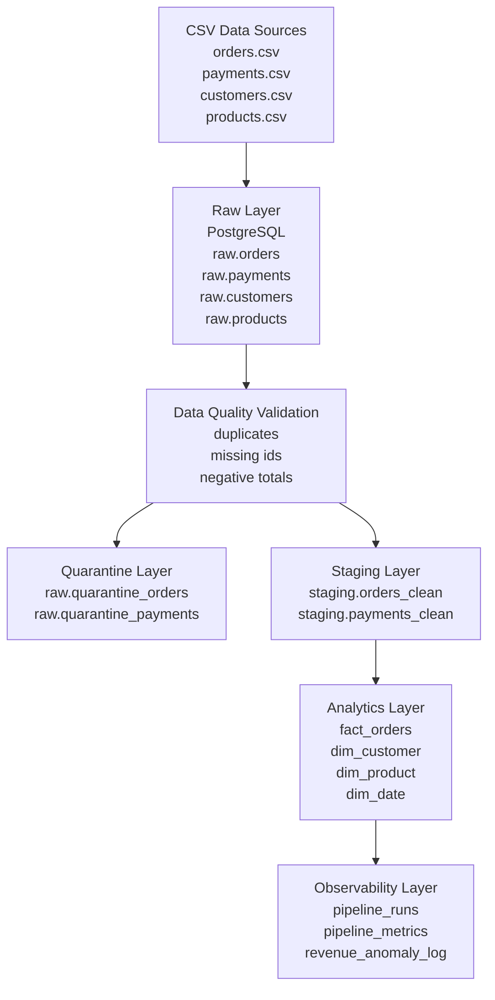
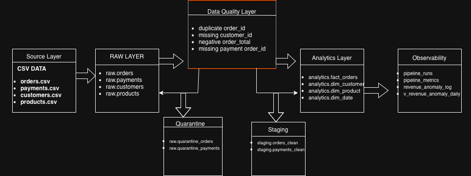
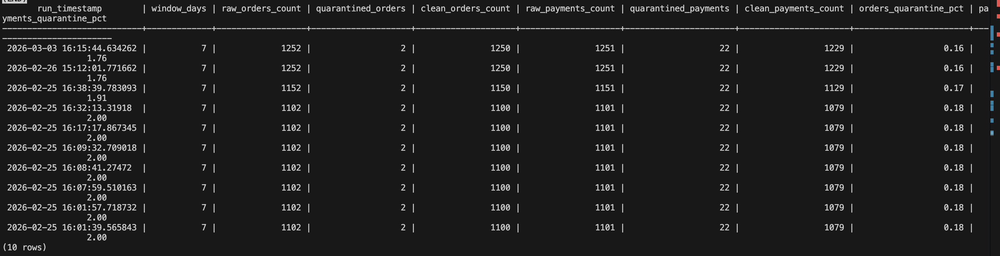
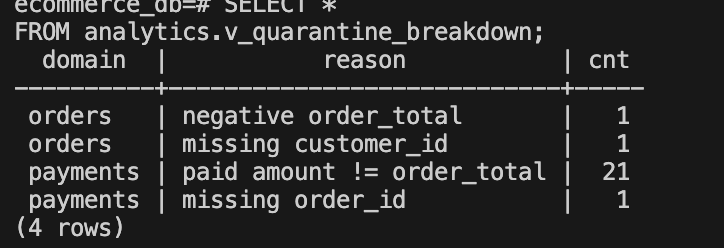
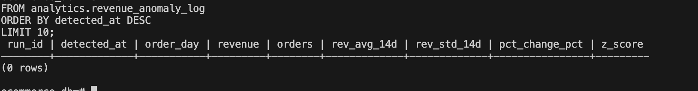

# E-Commerce Data Engineering Pipeline

A **production-style batch data pipeline** that ingests transactional e-commerce data, performs data quality validation, builds analytical models, and monitors pipeline health with anomaly detection and observability metrics.

This project demonstrates real-world **data engineering patterns** including:

- layered warehouse architecture  
- data quality quarantine handling  
- incremental fact table rebuilding  
- pipeline observability  
- anomaly detection using statistical thresholds  

---

# Key Features

• Layered data warehouse architecture  
• Data quality validation with quarantine tables  
• Incremental processing using sliding window rebuilds  
• Pipeline observability and run tracking  
• Revenue anomaly detection  
• Dockerized environment for reproducibility  

---

# Tech Stack

• Python  
• PostgreSQL  
• SQL  
• Docker  
• psycopg2  

---

# Quick Start

## Quick Start

### 1. Create Python environment
```bash
python -m venv .venv
source .venv/bin/activate
```

### 2. Install dependencies
```bash
pip install -r requirements.txt
```

### 3. Run the pipeline
```bash
python scripts/run_pipeline.py
```

### 4. Run validation checks
```bash
python scripts/run_checks.py
```

---

# Run with Docker

```bash
docker compose up --build
```

Access database:

```bash
docker exec -it ecommerce_db psql -U postgres -d ecommerce_db
```

---
# Architecture



## Architecture Diagram


---

# Pipeline Flow

1. Raw CSV files are ingested into PostgreSQL **raw tables**.
2. Data quality rules validate records.
3. Invalid records are written to **quarantine tables**.
4. Clean records are loaded into **staging tables**.
5. Analytics tables are incrementally rebuilt.
6. Observability metrics and anomaly detection are recorded.

---

# Data Layers

## Raw Layer

Stores ingested data exactly as received.

Tables:

```
raw.orders
raw.payments
raw.customers
raw.products
```

---

## Quarantine Layer

Invalid records are isolated to prevent bad data reaching analytics.

Tables:

```
raw.quarantine_orders
raw.quarantine_payments
```

---

## Staging Layer

Contains validated and cleaned data.

Tables:

```
staging.orders_clean
staging.payments_clean
```

---

## Analytics Layer

Warehouse-ready dimensional model.

### Fact Table

```
analytics.fact_orders
```

Columns:

- order_id
- customer_id
- order_day
- order_total
- payment_status
- payment_amount

### Dimension Tables

```
analytics.dim_customer
analytics.dim_product
analytics.dim_date
```

---

# Data Quality Rules

The pipeline enforces validation rules before data reaches analytics.

### Orders Validation

- duplicate `order_id` detection
- missing `customer_id`
- negative `order_total`

### Payments Validation

- missing `order_id`

Invalid records are written to quarantine tables.

---

# Data Quality Gate

The pipeline stops execution if excessive data quality failures are detected.

Example threshold:

```
MAX_ALLOWED_ERRORS = 5
```

If quarantine counts exceed this threshold, the pipeline run is marked as **failed** in:

```
analytics.pipeline_runs
```

This prevents corrupted data from reaching the analytics layer.

---

# Incremental Processing

The pipeline uses incremental processing to avoid rebuilding the entire warehouse.

```
WINDOW_DAYS = 7
```

During each run:

• recent rows in `analytics.fact_orders` are deleted  
• the latest `WINDOW_DAYS` of data is rebuilt from staging  
• historical records remain unchanged  

This simulates incremental rebuild patterns used in production data warehouses.

---

# Pipeline Observability

Pipeline health and execution metrics are tracked for every run.

## Pipeline Runs

Table:

```
analytics.pipeline_runs
```

Tracks:

- run_id
- start time
- finish time
- status
- window_days
- failure notes

---

## Pipeline Metrics

Table:

```
analytics.pipeline_metrics
```

Tracks:

- raw_orders_count
- quarantined_orders
- clean_orders_count
- raw_payments_count
- quarantined_payments
- clean_payments_count
- quarantine percentages

These metrics help monitor pipeline health.

---

# Revenue Anomaly Detection

Daily revenue anomalies are detected using statistical thresholds.

View:

```
analytics.v_revenue_anomaly_daily
```

Detection uses:

- rolling 14-day average
- rolling standard deviation
- Z-score anomaly detection

Example query:

```sql
SELECT order_day, revenue, z_score
FROM analytics.v_revenue_anomaly_daily
WHERE is_anomaly = true;
```

---

# Example Queries

### Daily revenue

```sql
SELECT order_day, SUM(order_total) AS revenue
FROM analytics.fact_orders
GROUP BY order_day
ORDER BY order_day DESC;
```

---

### Detect anomalies

```sql
SELECT *
FROM analytics.v_revenue_anomaly_daily
WHERE is_anomaly = true;
```

---

# Project Structure

```
ecommerce-data-pipeline
│
├── data
│   ├── orders.csv
│   ├── payments.csv
│   ├── customers.csv
│   └── products.csv
│
├── scripts
│   ├── run_pipeline.py
│   └── run_checks.py
│
├── sql
│   ├── init
│   │   └── create_schemas.sql
│   │
│   └── checks
│       └── contracts.sql
│
├── Dockerfile
├── docker-compose.yml
├── requirements.txt
└── README.md
```

---

# What This Project Demonstrates

This project demonstrates several **real-world data engineering patterns**:

• layered data warehouse design  
• automated data validation pipelines  
• quarantine handling for bad records  
• incremental data processing  
• pipeline observability and monitoring  
• statistical anomaly detection  

These are commonly used patterns in production data platforms.

## Sample Outputs

### Pipeline Metrics Trend


### Quarantine Breakdown


### Revenue Anomalies

